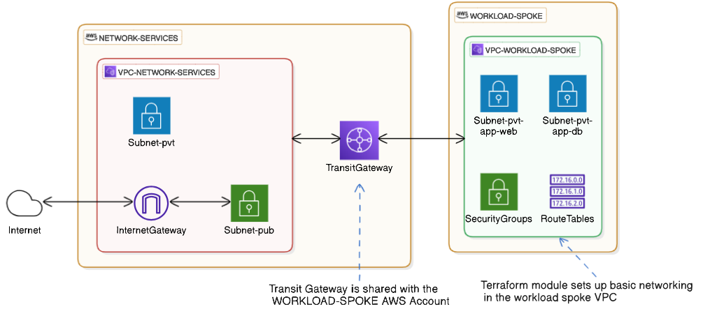

# OpenTofu Module: `vpc-spoke-tgw`

This OpenTofu module provisions foundational networking infrastructure in **spoke VPCs** that host business applications or workloads. It helps to quickly set up basic networking required by workloads in a multi-account hub-spoke network topology on AWS, where all ingress and egress traffic to/from the workload VPC passes through a *hub* VPC (in another AWS account) via a Transit Gateway (TGW).

## Features
- Provisions the following network infrastructure in a spoke AWS account:
  - A VPC with subnets
  - TGW share acceptance and TGW attachments
  - Route tables with local and TGW-bound routes
  - DHCP options set with custom DNS settings
  - Security Groups for workloads
- Leverages the cloudposse terraform-null-label module to assign standardized names to provisioned resources.
- Applies tags consistently to provisioned resources.

## Prerequisites

- The TGW set up in the `network services` AWS account must be shared with the `workload` AWS account via Resource Access Manager (RAM) and the `TGW share ARN` must be made available. Ideally, if the TGW share is automated via OpenTofu, then the ARN may be accessed from OpenTofu state.
- The `TGW ID` must be made available. Ideally, if the TGW provisioning is automated via OpenTofu, then the TGW ID may be accessed from OpenTofu state.

<!-- BEGIN_TF_DOCS -->
## Requirements

| Name | Version |
|------|---------|
|  [terraform](#requirement\_terraform) | ~> 1.0, >= 1.8 |
|  [aws](#requirement\_aws) | ~> 5.0 |

## Providers

| Name | Version |
|------|---------|
|  [aws](#provider\_aws) | ~> 5.0 |

## Modules

| Name | Source | Version |
|------|--------|---------|
|  [networking\_base\_label](#module\_networking\_base\_label) | cloudposse/label/null | 0.25.0 |
|  [networking\_dop\_label](#module\_networking\_dop\_label) | cloudposse/label/null | 0.25.0 |
|  [networking\_rtb\_label](#module\_networking\_rtb\_label) | cloudposse/label/null | 0.25.0 |
|  [networking\_sg\_label](#module\_networking\_sg\_label) | cloudposse/label/null | 0.25.0 |
|  [networking\_subnet\_label](#module\_networking\_subnet\_label) | cloudposse/label/null | 0.25.0 |
|  [networking\_tgw\_attachment\_label](#module\_networking\_tgw\_attachment\_label) | cloudposse/label/null | 0.25.0 |
|  [networking\_vpc\_label](#module\_networking\_vpc\_label) | cloudposse/label/null | 0.25.0 |

## Resources

| Name | Type |
|------|------|
| [aws_ec2_transit_gateway_vpc_attachment.this](https://registry.terraform.io/providers/hashicorp/aws/latest/docs/resources/ec2_transit_gateway_vpc_attachment) | resource |
| [aws_ram_resource_share_accepter.this](https://registry.terraform.io/providers/hashicorp/aws/latest/docs/resources/ram_resource_share_accepter) | resource |
| [aws_route.tgw_route](https://registry.terraform.io/providers/hashicorp/aws/latest/docs/resources/route) | resource |
| [aws_route_table.this](https://registry.terraform.io/providers/hashicorp/aws/latest/docs/resources/route_table) | resource |
| [aws_route_table_association.this](https://registry.terraform.io/providers/hashicorp/aws/latest/docs/resources/route_table_association) | resource |
| [aws_security_group.this](https://registry.terraform.io/providers/hashicorp/aws/latest/docs/resources/security_group) | resource |
| [aws_subnet.this](https://registry.terraform.io/providers/hashicorp/aws/latest/docs/resources/subnet) | resource |
| [aws_vpc.this](https://registry.terraform.io/providers/hashicorp/aws/latest/docs/resources/vpc) | resource |
| [aws_vpc_dhcp_options.this](https://registry.terraform.io/providers/hashicorp/aws/latest/docs/resources/vpc_dhcp_options) | resource |
| [aws_vpc_dhcp_options_association.this](https://registry.terraform.io/providers/hashicorp/aws/latest/docs/resources/vpc_dhcp_options_association) | resource |
| [aws_vpc_security_group_egress_rule.this](https://registry.terraform.io/providers/hashicorp/aws/latest/docs/resources/vpc_security_group_egress_rule) | resource |
| [aws_vpc_security_group_ingress_rule.this](https://registry.terraform.io/providers/hashicorp/aws/latest/docs/resources/vpc_security_group_ingress_rule) | resource |
| [aws_availability_zones.current](https://registry.terraform.io/providers/hashicorp/aws/latest/docs/data-sources/availability_zones) | data source |
| [aws_region.current](https://registry.terraform.io/providers/hashicorp/aws/latest/docs/data-sources/region) | data source |

## Inputs

| Name | Description | Type | Default | Required |
|------|-------------|------|---------|:--------:|
|  [app\_id](#input\_app\_id) | The universally unique application ID for the service. Only alphanumeric characters are valid, with a string length from 3 to 8 characters. | `string` | `"appid"` | no |
|  [dns\_domain](#input\_dns\_domain) | Domain name for DHCP option set | `string` | `""` | no |
|  [dns\_servers](#input\_dns\_servers) | List of custom DNS servers to use | `list(string)` | `[]` | no |
|  [environment](#input\_environment) | A valid Infrastructure Environment | `string` | `"poc"` | no |
|  [global\_tags](#input\_global\_tags) | A map of global tags to apply to all resources. | `map(string)` | `{}` | no |
|  [org](#input\_org) | A name or abbreviation for the Organization. Only alphanumeric characters and hyphens are valid, with a string length from 3 to 8 characters. | `string` | `"acme-it"` | no |
|  [security\_groups](#input\_security\_groups) | List of security groups with associated ingress and egress rules | <pre>list(object({     alias       = string     description = string     ingress = optional(list(object({       description     = string       cidr_ipv4       = optional(string) # Optional for source CIDR       source_sg_alias = optional(string) # Optional for source SG       ip_protocol     = string       from_port       = optional(number) # Optional for cases like `-1` protocol       to_port         = optional(number) # Optional for cases like `-1` protocol     })))     egress = optional(list(object({       description          = string       cidr_ipv4            = optional(string) # Optional for destination CIDR       destination_sg_alias = optional(string) # Optional for destination SG       ip_protocol          = string       from_port            = optional(number) # Optional for cases like `-1` protocol       to_port              = optional(number) # Optional for cases like `-1` protocol     })))   }))</pre> | n/a | yes |
|  [shared\_transit\_gateway\_arn](#input\_shared\_transit\_gateway\_arn) | The ARN of the Ingress network account's shared Transit Gateway. | `string` | n/a | yes |
|  [subnet\_cidrs](#input\_subnet\_cidrs) | A map of subnet aliases and their associated list of CIDR blocks across multiple AZs, with an alias length from 3 to 8 lowercase alphanumeric characters and valid CIDR blocks. | `map(list(string))` | `{}` | no |
|  [tgw\_sharing\_enabled](#input\_tgw\_sharing\_enabled) | Enable or disable the Transit Gateway sharing and attachment resources. Set to true to create the resources. | `bool` | `false` | no |
|  [transit\_gateway\_id](#input\_transit\_gateway\_id) | Transit Gateway ID for the peering connection. TBD: Obtain output from another tofu module. | `string` | n/a | yes |
|  [vpc\_cidr](#input\_vpc\_cidr) | The CIDR block for the VPC | `string` | n/a | yes |

## Outputs

| Name | Description |
|------|-------------|
|  [security\_groups](#output\_security\_groups) | Map of security groups |
|  [subnets](#output\_subnets) | Map of subnets |
|  [vpc\_id](#output\_vpc\_id) | VPC ID |
<!-- END_TF_DOCS -->